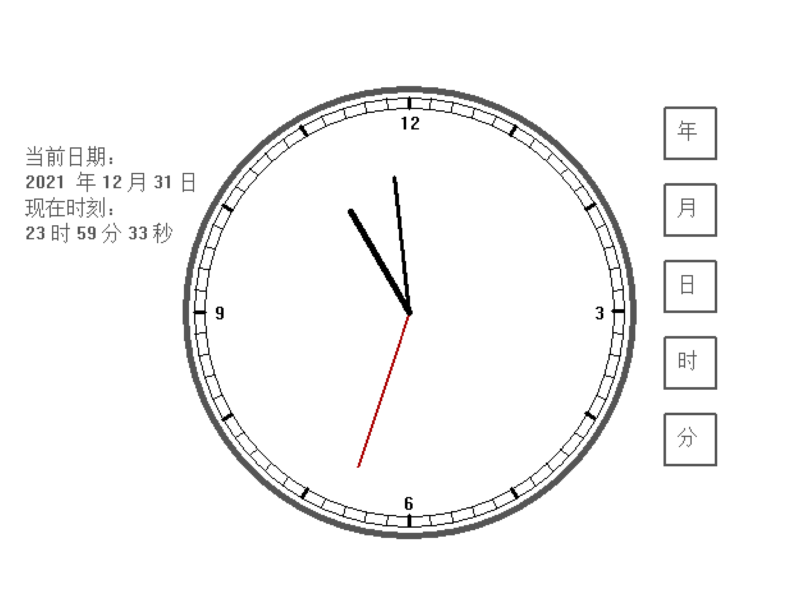

# Simulated Clock Software

## Introduction
This project is a graphical simulated clock developed as part of a lab at Wuhan Institute of Technology. It features both an analog and digital display of the current time and supports various features including leap years and month length adjustments. The software is built using C++ and the EasyX Graphics Library.

[](https://github.com/qqqxs/Simulation-Clock/graphs/contributors)
[](https://github.com/qqqxs/Simulation-Clock/network/members)
[](https://github.com/qqqxs/Simulation-Clock/stargazers)
[](https://github.com/qqqxs/Simulation-Clock/issues)
[](https://github.com/qqqxs/Simulation-Clock/blob/main/LICENSE)

## Content
- [Features](https://github.com/qqqxs/Simulation-Clock?tab=readme-ov-file#feature)
- [Technologies Used](https://github.com/qqqxs/Simulation-Clock?tab=readme-ov-file#technologies-Used)
- [Installation](https://github.com/qqqxs/Simulation-Clock?tab=readme-ov-file#installation)
- [Useage](https://github.com/qqqxs/Simulation-Clock?tab=readme-ov-file#useage)

## Features
- **Analog Clock Dial**: Displays time with a smooth mechanical movement simulation.
- **Digital Time Display**: A real-time digital clock running alongside the analog display.
- **Date Configuration**: Interactive interface for setting and displaying the current date, supporting leap years and variable month lengths.
- **Real-Time Updates**: Both analog and digital displays update in real-time to reflect changes in the system time.

## Technologies Used
- **C++**: The primary language used for developing the clock simulation.
- **EasyX Graphics Library**: Utilized to create the graphical interface and render the clock’s visual elements.

## Installation
1. Clone the repository:
   ```bash
   git clone https://github.com/qqqxs/simulated-clock.git
2. Install the EasyX Graphics Library (if not already installed).
3. Compile and run the code in your preferred C++ IDE or using the command line.

## Useage
1. Launch the program to display the analog and digital clock.
2. Use the interactive interface to configure the date and time, with support for leap years and month-length variations.
3. Observe the real-time updates in both analog and digital formats.

## Screenshots
<p align="center">
  
</p>
